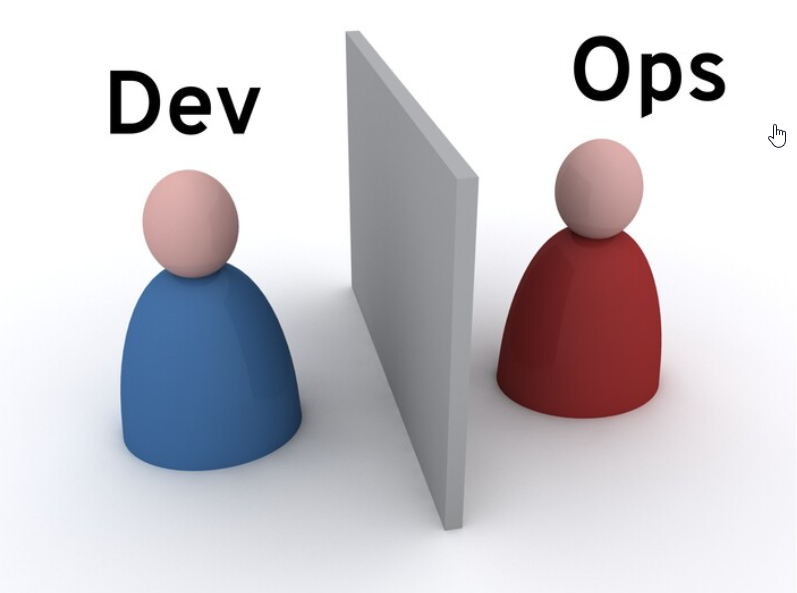

# DevOps culture pivot - BAT 6

### What is DevOps?
DevOps is an enabler for rapid flow of business ideas to working solutions that make your company money - increase revenues, satisfy customers, or reduce costs.

[comment]: <DevOps is complete set of practices that automates the process between development and operation teams so they can easily build, test and release software faster and more more relaiably>

###  How many DevOps engineers does it take to screw in a light bulb?
Just one, but they have to first make the light bulb, then the socket, then come up with an automated process while creating institutional change.

### DevOps was initially conceptualized in 2007/2008, now its way of life
[comment]: <In past we have discussed about successful organizations like Target and Etsy who have enhanced their posture significantly by uping their digital game, and they were able to do that by adopting DevOps culture>

#### DevOps is NOT just…
- easily achieved nor implemented
- a product or tool chain
- a job title or role
- a cloud infrastructure provider
- a book
- a technology
- a programming language
- a marketing campaign
- CI/CD
- Kubernetes
- containers
- open source software
- Infrastructure as Code
- automation

#### DevOps is 
- a concept
- a mindset
- a shared attitude understood and embraced by individuals
- a culture that must be nurtured and iteratively improved
- sharing
- mentoring
- learning
- inclusive and open to all ideas
- iterative
- continuous
- collaborative
- an awesome way to confidently develop and deliver software

### How are we doing it?
- Communities of practice
- Academies
- Learning partnerships with industry leaders
- Lunch and Learns
